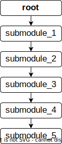
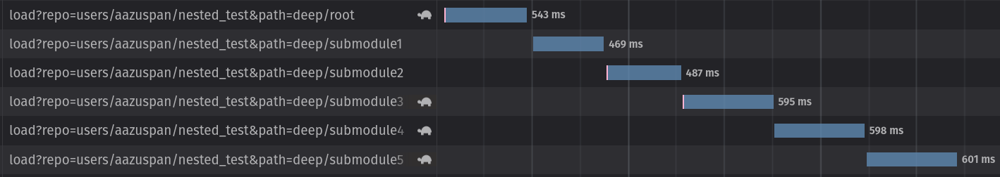
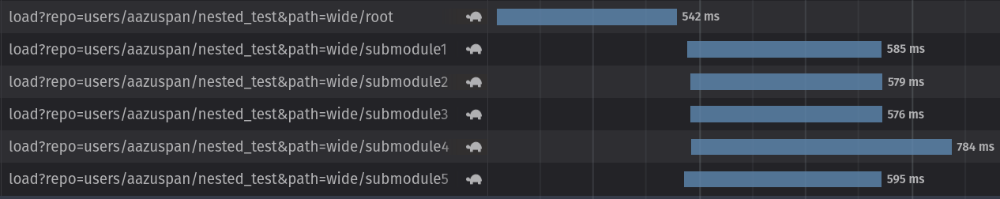
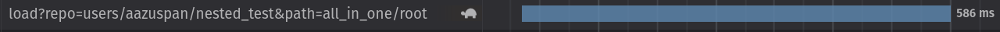

Title: Optimizing Module Structure in Earth Engine
Category: Earth Engine
Tags: earth-engine, modules, javascript, code-editor
Authors: Aaron Zuspan
Summary: Nested file structures are great for organization and terrible for import speed in Earth Engine modules. Let's figure out why and what we can do about it.
Date: 2022-06-09

In a [recent blog post](https://aazuspan.github.io/should-you-minify-your-earth-engine-modules.html), I found that shrinking an Earth Engine module's size by 75% had almost no effect on import speed in the Code Editor because most of the time was spent waiting for Earth Engine to find it, not downloading its contents. That made me wonder, if each required file incurs some unavoidable overhead in import time, can you speed up module imports by simplifying a module's file structure? 

## Module Design

When building an Earth Engine module, I usually make one root file that imports from submodules. That allows for organization of code while only requiring users to make a single import. For example, I might have a file called `tools` with the following contents:

```js
exports.ui = require("users/aazuspan/repo:src/ui.js")
exports.image = require("users/aazuspan/repo:src/image.js")
```

The `ui` and `image` submodules would contain their own exported functions. A user could import `tools` and access both submodules, like so:

```js
var tools = require("users/aazuspan/repo:tools");

tools.image.maskClouds(...)
tools.ui.legend(...)
```

If you count the `require` calls above, you can see that Earth Engine is going to have to request three separate files in order to load `tools`. If each of those requests is made synchronously and has a minimum overhead time, imports might get painfully slow in complex projects. Would I be better off just including all my source code in a single file?

<center><iframe src="https://giphy.com/embed/9jObH9PkVPTyM" width="480" height="271" frameBorder="0" class="giphy-embed" allowFullScreen></iframe></center>

To test whether I've been accidentally sabotaging my import times, I set up a variety of module designs to see how file structure affects import speed.

## The Test

In my [previous experiment](https://aazuspan.github.io/should-you-minify-your-earth-engine-modules.html) with module import times, I used Python to automate and time the imports. For this experiment, I stuck to the browser, tracking request times with the developer tools. I figured the Code Editor might be able to optimize imports, maybe caching requests to nearby modules or performing requests asynchronously. The lack of automation would make it harder to run repeated tests, but would ensure results were representative of actual import times experienced by users.

I set up three different modules, each organized with a different layout, to compare the effect of different module structures on import times. To eliminate download time as a confounding variable, each module contained exactly 395 bytes of code.

### 1. Chained Structure

The first module I tested contained one root module with five submodules, arranged depthwise. The root module required the first submodule, which required the second submodule, which required the third, etc. Starting at the root module, imports would work their way down each link in the chain until the last submodule was finally returned. Because each submodule would need to be retrieved before the next module could be requested, I suspected this chained design would be the slowest to import.

<center></img></center>

### 2. Branched Structure

The second module also contained one root module with five submodules. However, unlike the chained module, the imports for each submodule in the branched structure were declared in the root module (the design I described at the beginning of this post). Because all of the required submodule paths could be known as soon as the root module was received and parsed, this is where I suspected Earth Engine might optimize import times by requesting multiple submodules asynchronously. At least, that was my hope.

<center></img></center>

### 3. Monolithic Structure

If each instance of `require` adds some overhead to import time, the fastest import should be achieved with only a single file. I used this monolithic structure, with one root module containing the contents of all the submodules, for the third experimental structure.

<center></img></center>


## The Results

### Chained is Slow

Watching network traffic when importing the root file of the chained module revealed that six synchronous requests were made. Because each submodule contained the path to the next, the final submodule could only be imported after all the previous submodules were resolved. You can see that timeline of requests, happening one after the other, below.



Averaged over 10 runs, it took **3.24 seconds** to fully import the chained module.

### Branched is Faster

In comparison, the network traffic below shows how the branched module structure allowed for asynchronous requests. As soon as the submodule paths were retrieved from the root module, the remaining requests were made simultaneously.



On average, the branched module imported fully in **1.30 seconds**, almost 3 times faster than the chained module. 

### One is the Fastest Number

Unsurprisingly, the single-file monolithic module made only one request, which was resolved just as fast as any of the multiple requests made by the other structures.



The monolithic module took only **0.573 seconds** to import on average, about 6x faster than the chained module and 2x faster than the branched module.

### Scaling Up

The results above painted a pretty clear picture, but I was curious whether things might change as the number of submodules changed. I reran the experiment, including between 1 and 10 submodules in each of the structures.

<iframe src="./assets/nested_module_scale.html" width=800 height=400 frameBorder="0"></iframe>

Import times for the chained module scaled linearly as more submodules were added, as expected. The branched module showed a smaller, but noticeable increase in import times as submodules increased. Apparently there was still *some* penalty for the additional imports, even when made asynchronously. The number of submodules had no effect on import speed of the monolithic module, as download times for the additional data were negligible compared to the overhead request time.

## Lessons Learned

Using what I learned above, I decided to take a closer look at the structure of my Earth Engine modules called [snazzy](https://github.com/aazuspan/snazzy). Here's the module layout:

<center></img></center>

In the interest of organization, I accidentally created a chained set of imports. The root `styles` must be imported first, which imports `styles.js`, which imports `tags.js`. A few tests revealed that the module takes **2.03 seconds** to import, which matches the expected import time for a chained module with 2 submodules that I measured earlier. 

I decided to simplify the structure to a single, monolithic module, moving all of the code into `styles.` The result was a **72% reduction** in import time, down to an average of only **0.551 seconds**.

<center></img></center>

So, will I build all of my Earth Engine modules in a single file from now on? Probably not. Being able to organize complex projects across multiple files dramatically improves maintainability, and that may be worth the cost in performance. However, I will pay closer attention to module structure, and avoid chained imports like I had in `snazzy` whenever possible. 

Of course, compromising performance for organization (or vice-versa) isn't great, so maybe there's a third option. Specifically, I'm thinking that there's a need for a tool that could be set up to automatically merge nested submodules into a single root module. This step could be run through an automated Github workflow whenever new code is pushed, essentially compiling the project and pushing it to Earth Engine. That would allow for performant imports *and* clean, well-organized code. [Minification](https://aazuspan.github.io/should-you-minify-your-earth-engine-modules.html) could even be run at the same time to speed up imports just a little bit more. 

But for the time being, I plan to just pay a little more attention to my module design.

## TLDR
- Each file import in Earth Engine takes times, regardless of file size
- Chained imports (`A` requires `B` requires `C`) occur synchronously. Each import linearly increases the total import time.
- Branched imports (`A` requires `B` *and* `C`) occur asynchronously. There isn't much difference between one and ten branched imports.
- Single file imports are the fastest possible, but they can make organization difficult.